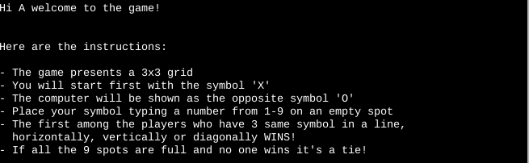
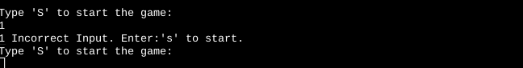
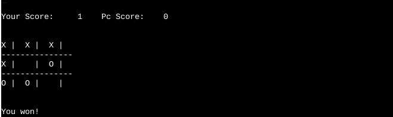
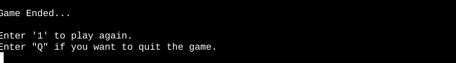

# TIC TAC TOE Game - Python

## Introduction

Tic Tac Toe game is the third project challenge with Code Institute in order to acquire the Full Stack Developer diploma. The game is created using Python, as required.

Tic-tac-toe is a game where two players take turns in drawing either an ' O' or an ' X' in one square of a grid consisting of nine squares, against the computer.
The first player who gets 3 same symbols in a row (horizontally, vertically or diagonally) wins!

Please find the live progect [here:](https://p3-tic-tac-toe.herokuapp.com/) 

***foto  amiresponsive

## Table Of Contents
+ [UX](#ux "UX")
  + [User Stories](#userstories "User Stories")
    + [As a player:](#first-time-user "As a player:")
+ [Features](#features "Features")  
  + [Introduction](#Introduction "Introduction")
  + [Instructions](#Instructions "Instructions") 
  + [Start Game](#Start-Game "Start Game")
  + [Play Game](#Start-Game "Play Game")    

## UX:
### User Stories
#### As a player:

- I want to play a game with clear and easy instructions
- I want to be able to see my scores
- I want to be able to play the game again or quit easily    

## Features:

### Introduction

Once the program runs, the user is welcomed to the game and they are asked them to insert their Name. This will be used through the game for fidelization purposes.
The "welcome to the game" statement has a sys.stdout.flush() method applied for a better visual effect.

 

### Instructions
After the validated name is inserted, a small explaination of the rules is shown , as per screenshot below:

 

### Start Game
In the next step the user is asked to type "S" to start playing. Thanks to the validation applied, the terminal will accept any "S" format, uppercase or lowercase, if the element typed ny the user is different that "S" they will get error message stating to type "S" again correctly.

 

### Play Game
The user will get to play first, with the Sumbol 'X', while the PC will be shown as "O". Based on the spot typed, from 1 to 9, the board will be filled with the relative symbol.
The game is fully validated, so if the user choses a spot already taken they will get the relative message. In case of a win, the score will incerement and it's shown before right on top on the game board.

### Play Again or quit
Once the game is finished, a "Game ended" message is printed, and the user will have the option to start again (with previous scores), or quit the game. In case they want to quit, a thank you message will be printed.

