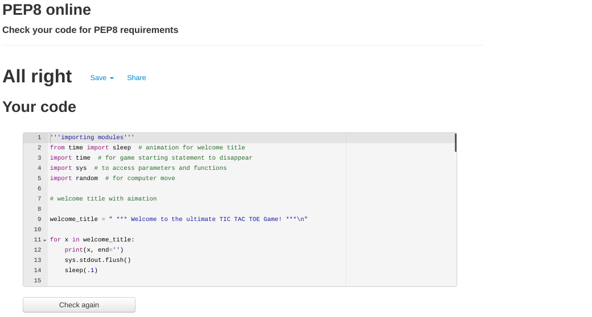

# TIC TAC TOE Game - Python

## Introduction

Tic Tac Toe game is the third project challenge with Code Institute in order to acquire the Full Stack Developer diploma. The game is created using Python, as required.

Tic-tac-toe is a game where two players take turns in drawing either an ' O' or an ' X' in one square of a grid consisting of nine squares, against the computer.
The first player who gets 3 same symbols in a row (horizontally, vertically or diagonally) wins!

Please find the live progect [here:](https://p3-tic-tac-toe.herokuapp.com/) 

***foto  amiresponsive

## Table Of Contents

+ [UX](#ux "UX")
  + [User Stories](#userstories "User Stories")
    + [As a player:](#first-time-user "As a player")
+ [Features](#features "Features")  
  + [Introduction](#Introduction "Introduction")
  + [Instructions](#Instructions "Instructions") 
  + [Start Game](#Start-Game "Start Game")
  + [Play Game](#Start-Game "Play Game")
+ [Future Features](#future-features "Future Features") 
+ [External Sources Used](#external-sources-used "External Sources Used")  
   

## UX:
### User Stories
#### As a player

- I want to play a game with clear and easy instructions
- I want to be able to see my scores
- I want to be able to play the game again or quit easily    

## Existing Features:

### Introduction

Once the program runs, the user is welcomed to the game and they are asked them to insert their Name. This will be used through the game for fidelization purposes.
The "welcome to the game" statement has a sys.stdout.flush() method applied for a better visual effect.

 

### Instructions

After the validated name is inserted, a small explaination of the rules is shown , as per screenshot below:

 

### Start Game

In the next step the user is asked to type "S" to start playing. Thanks to the validation applied, the terminal will accept any "S" format, uppercase or lowercase, if the element typed ny the user is different that "S" they will get error message stating to type "S" again correctly.

 

### Play Game

The user will get to play first, with the Sumbol 'X', while the PC will be shown as "O". Based on the spot typed, from 1 to 9, the board will be filled with the relative symbol.
The game is fully validated, so if the user choses a spot already taken they will get the relative message. In case of a win, the score will incerement and it's shown before right on top on the game board.

### Play Again or quit

Once the game is finished, a "Game ended" message is printed, and the user will have the option to start again (with previous scores), or quit the game. In case they want to quit, a thank you message will be printed.

 
 [Back to top](#table-of-contents)

## Future Features

- Give an option to the user to choose the symbol they want
- Let user decide if they want to go first 
- Option to allow the user to play with someone else, than the computer
- Send scores via email
- make an impossible to win game against the computer

## Technology Used

 - [Python](https://www.python.org/) 
 - [JavaScript](https://www.javascript.com/) provided in the Code Institute Template
 - [CSS](https://en.wikipedia.org/wiki/CSS)  provided in the Code Institute Template
 - [HTML](https://en.wikipedia.org/wiki/HTML)  provided in the Code Institute Template

## External Sources Used

- Stack Overflow
- W3 School
- Youtube

## Python Libraries Used

- [Random](https://docs.python.org/3/library/random.html)  for computer random moves 
- [Time and Sleep](https://realpython.com/python-sleep/) for text animation / disappearence
- [Sys](https://docs.python.org/3/library/sys.html)  for specific parameters and functions

## Testing

Testing was conducted very carefully through the entire project. Pep 8 validator came back with no issues
[Pep8](http://pep8online.com/)

 

- Python pylint reports currently 3 main and known issues:

  - Using the global statement: global statement is used during the creation of the game to access global variables, listed at the top of python file. The usage of 'global' is not fully recommended as it can make harder to detect bugs and issuees in a very big program, however building Tic Tac Toe game as a beginner, I found it a simple approach to define the global variables in the begining of the file and access them later whenever needed in the functions.

  - Constant name 'variable' doesn't conform to UPPER_CASE naming style: variable used are not indended as constant in this game, they respect the expected naming convention, furthermore the code passes Pep8 Validator correctly.

  - Redefining  name 'board' from outer the scope: this issue passes through Pep8 as well. As per mentor's confirmation  

  ## Bugs and Solutions

- Function for scores was not working, it was not being called correctly. Fixed the issue by calling it in  who_is_the_winner(board) function, right after checking win for all possible rows.

- Method to make 'Game starting' disappear after few second was not working'. Needed to implement print(" " * len(game_starting), end="\r").

- Name and move input validation was not fully functional. Went back to 'Love Sandwiches' video for exceptions, and implemented code correctly.

## Development and Deployment

This project was developed through Gitpod, using the template provided from Code Institure. Every step was documented and pushed thoroughly via GitHub.

The deployment is made using [Heroku](https://www.heroku.com/) following the listed steps:

1. Log in or register a new account on Heroku
2. Click on 'New' in the dashboard and select 'Create New App'
3. Select a name for the app and choose your region.
4. Click on "Create app"
4. When the app is created by clicking on Setting 
5. To improve compatibility with various Python libraries add  Config Var with Key = PORT and the Value = 8000 
5. Add 2 buildpacks: Python and then nodes in this specific order
6. Go back at the top and click on 'Deploy' and select 'GitHub'
7. Scroll down and click on 'Connect to GitHub'
8. Search for your GitHub repository name by typing it 
9. Click on 'Connect'
10. Scroll down and click on 'Deploy Branch'
11. You will see a message 'The app was successfully deployed when the app is built with python and all the depencencies
12. Click on view and you will see the [deployed site](https://p3-tic-tac-toe.herokuapp.com/)

